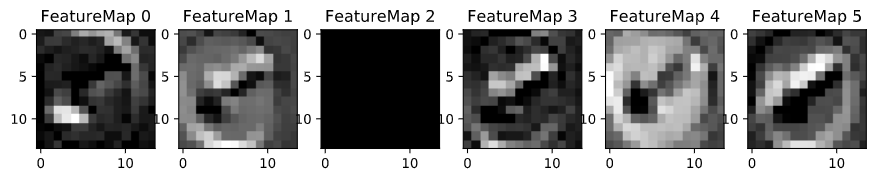

# **Traffic Sign Recognition with CNN** 

## Overview

Trained and tested convolutional neural network on the [German Traffic Sign Dataset](http://benchmark.ini.rub.de/?section=gtsrb&subsection=dataset).

The goals / steps of this project are the following:
* Load the data set
* Explore, summarize and visualize the data set
* Design, train and test a model architecture
* Use the model to make predictions on new images
* Analyze the softmax probabilities of the new images
* Visalize internal layers of neural network on test images


**Files:**
- Project's notebook is [Traffic_Sign_Classifier.ipynb](./Traffic_Sign_Classifier.ipynb)
- Generated HTML from the juyter notebook is [report.html](./report.html)
- Project's .py file is [Traffic_Sign_Classifier.py](./Traffic_Sign_Classifier.py) (used to generate the notebook) is included
- Trained neural network model is saved in `model` directory


[//]: # (Image References)

[image1]: ./examples/visualization.jpg "Visualization"
[image2]: ./examples/grayscale.jpg "Grayscaling"
[image3]: ./examples/random_noise.jpg "Random Noise"
[image4]: ./examples/placeholder.png "Traffic Sign 1"
[image5]: ./examples/placeholder.png "Traffic Sign 2"
[image6]: ./examples/placeholder.png "Traffic Sign 3"
[image7]: ./examples/placeholder.png "Traffic Sign 4"
[image8]: ./examples/placeholder.png "Traffic Sign 5"

---

## Data Set Summary & Exploration

For exploring size of data sets, `len()`, numpy `.shape` and `np.unique` was used (to check number of unique labels).

* The size of training set is 34799
* The size of the validation set is 4410
* The size of test set is 12630
* The shape of a traffic sign image is (32, 32, 3)
* The number of unique classes/labels in the data set is 43

Here is the random image from a train data set.


## Model Architecture

### Preprocessing: 

Preprocessing step is simply scaling image from [0, 255] range to [-1, 1] range. Motivation is that a neural network has easier time to train its parameters (weights) when data is normalized with mean being at 0 and equal variance.

```python
def preprocess(x):
    return (x.astype(np.float32) - 128) / 128
```

Quick sanity check asserted that now our data is in range [-1, 1):
```python
np.max(X_train_processed)
np.min(X_train_processed)
```
Printing it gives:
```
Max value in preprocessed train data 0.9921875
Min value in preprocessed train data -1.0
```

### Neural Network Architecture

The final model consists of the following layers:

| Layer         		|     Description	        					| 
|:---------------------:|:---------------------------------------------:| 
| Input         		| 32x32x3 RGB image   							| 
| Convolution 5x5       | 1x1 stride, valid padding, outputs 28x28x6 	|
| RELU					|												|
| Max pooling			| 2x2 stride, outputs 14x14x6					|
| Dropout     	        | Keep rate is 0.9 	                            |
| Convolution 5x5       | 1x1 stride, valid padding, outputs 10x10x16 	|
| Max pooling			| 2x2 stride, outputs 5x5x16					|
| Dropout     	        | Keep rate is 0.9 	                            |
| Fully connected		| Input is flat 5x5x16=400, outputs 120        	|
| RELU					|												|
| Dropout     	        | Keep rate is 0.75 	                        |
| Fully connected		| Input is 120, outputs 84        	|
| RELU					|												|
| Dropout     	        | Keep rate is 0.75 	                        |
| Classifier (logits)   | Input is 84, outputs 43 (num of classes)      |
| Softmax		        | Used for cross-entropy loss function			|


### Model Training, Hyperparameters

To train the model, I used Adam optimizer.

**Hyperparameters:**
- Learning rate: 0.001
- Epochs: 10
- Batch size: 128

### Solution Approach

My final model results were:
* training set accuracy of 98.8%
* validation set accuracy of 94.3%
* test set accuracy of 93.2%

I experimented with the following architectures:
1. **Baseline**: Classic LeNet architecture - it gave validation accuracy of around 0.910.
2. Then I replaced max pooling with average pooling, but it decreased accuracy to 0.876. 
3. Removed pooling completely, and applied dropout rate on 2 convolution layers with keep rate 0.75. Validation accuracy got 0.933. But since I removed pooling, my next layers didn't shrink, and I had too many parameters to train. (I could have experimented with increasing strides size to shrink model though).
4. Then I decided to put back max pooling, and apply dropout to 2 convolutions with the same rate 0.75. Validation accuracy 0.922.
5. ...After much more experimentation and surfing the web on when to apply dropout, I decided to apply dropout with keep rate 0.75 to 2 fully connected layers, as well as small dropout with keep rate 0.9 to 2 convolutional layers. Validation accuracy got 0.943.
 
**Motivation for convolutional layers**
* Applying two convolutional layers in the beginning makes sure we treat pixels that are close to each other together, and not completely independent, as is the case with fully connected layers.
* Convolutional layers also share same weights, thus it finds the same pattern well no matter if it's in the top left or top bottom of the image, since the filter with the same trained weights is applied to both regions.

**Dropout** is a regularization technique, it helps the network with redundant learning, making sure network does not depend solely on one node to pick out a certain feature.

## Testing a Model on New Images

Here are five German traffic signs that I found on the web (shown after rescaling to 32x32 size):


Top 3 images seem to be easy to classify. As for the last 2, there are quite many similar sign types in the data set, that look like "end of all speed and passing limits" and "keep left".

But as per the intuition stated above, the model had much higher uncertainty on the last 2 signs, as can be seen by top 5 softmax probabilities per image: 


The model successfully predicted all 5 test images, accuracy is 100%. The results correlate well with the accuracy on the test set, which is 93.2%. Of course for a statistically significant comparison, many more images from the web should be analyzed.

## Visualizing the Neural Network

Here is the visualization of the first convolution layer, when a test image, in our case "keep left" sign, is passed through the network: 


High activations are more white. Low or no activation is black.

It's interesting to see how different feature maps pick out different features.
* It's clear that map "1" and "4" (counting from 0) picked out blue color of the sign.
* "3" and "5" feature maps picked out arrow lines pretty well.
* "0" map picked out arrow itself well.
* "2" didn't pick anything in this case, thus it's black (probably "2" learned other patterns, from other traffic signs, but no pattern in this sign matched learned patterns in this map).

## Potential Improvements
The next best thing to do is to go ahead and read the paper which has the highest test accuracy for this famous data set. Some of the intuition for improvements are the following: 

* Creating synthetic data with transformed images would likely increase accuracy of the model. 
* Convert images to another color model, e.g. HLS, grayscale etc.
* Implementing **inception** - combining max pooling, 1x1 convolutions, and dropouts. 
* Making filter size deeper. Currently first conv layer has only depth 6.
* Tuning hyperparameters: batch size, epochs, learn rate, dropout rate.
